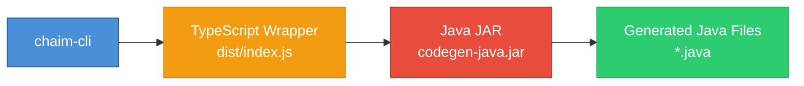

# AI Agent Context: chaim-client-java

**Purpose**: Structured context for AI agents to understand and work with the chaim-client-java codebase.

**Package**: `@chaim-tools/client-java`  
**Version**: 0.1.0  
**License**: Apache-2.0

---

## Project Overview

The chaim-client-java is a **hybrid Java/TypeScript package** that provides Java code generation from `.bprint` schemas. It produces DTOs, configuration classes, and DynamoDB mapper clients that integrate with generated SDKs.

### Key Capabilities

- **Java Code Generation**: Generate entity DTOs, ChaimConfig, and ChaimMapperClient classes
- **Schema Parsing**: Parse `.bprint` JSON schemas into Java model objects
- **TypeScript Wrapper**: Node.js interface for integration with chaim-cli
- **Multi-Module Gradle**: Organized as schema-core, cdk-integration, and codegen-java modules

### Architecture

```
┌─────────────────────────────────────────────────────────────┐
│                     chaim-cli (Node.js)                     │
│                                                             │
│  const generator = new JavaGenerator();                     │
│  await generator.generate(schema, pkg, outDir, metadata);   │
└─────────────────────────┬───────────────────────────────────┘
                          │ spawns
                          ▼
┌─────────────────────────────────────────────────────────────┐
│              TypeScript Wrapper (dist/index.js)             │
│                                                             │
│  - Resolves JAR path (bundled or dev)                       │
│  - Spawns Java process with args                            │
│  - Passes schema + tableMetadata as JSON strings            │
└─────────────────────────┬───────────────────────────────────┘
                          │ java -jar
                          ▼
┌─────────────────────────────────────────────────────────────┐
│           Java Code Generator (codegen-java.jar)            │
│                                                             │
│  Main.java → JavaGenerator.java → JavaPoet                  │
│  - Parses schema JSON                                       │
│  - Derives entity name from namespace                       │
│  - Generates .java files to output directory                │
└─────────────────────────────────────────────────────────────┘
```

---

## Related Packages

| Package | Relationship | Purpose |
|---------|-------------|---------|
| `chaim-cli` | **Consumer** | Invokes JavaGenerator for SDK generation |
| `@chaim-tools/chaim-bprint-spec` | **Schema format** | Defines `.bprint` schema structure |
| `@chaim-tools/cdk-lib` | **Upstream** | Produces snapshots with schema + metadata |

**Data flow**:


> 🔵 **CLI** → 🟠 **TypeScript** → 🔴 **Java** → 🟢 **Output**

---

## Technology Stack

| Component | Technology |
|-----------|------------|
| Java Version | Java 22+ |
| Build System | Gradle 8+ (multi-module) |
| Code Generation | JavaPoet 1.13 |
| JSON Parsing | Jackson 2.15 |
| AWS SDK | AWS SDK v2 (DynamoDB) |
| TypeScript | TypeScript 5.x |
| Node.js | Node.js 18+ |

---

## Repository Structure

```
chaim-client-java/
├── schema-core/                    # Core schema handling
│   └── src/main/java/io/chaim/core/
│       ├── BprintLoader.java       # Schema JSON loading
│       ├── BprintValidator.java    # Schema validation
│       ├── FieldType.java          # Type mapping
│       └── model/
│           └── BprintSchema.java   # Schema data model
│
├── cdk-integration/                # AWS CDK integration
│   └── src/main/java/io/chaim/cdk/
│       ├── TableMetadata.java      # DynamoDB metadata
│       ├── ChaimStackOutputs.java  # CFN output container
│       └── CloudFormationReader.java # CFN reader
│
├── codegen-java/                   # Code generation engine
│   └── src/main/java/io/chaim/generators/java/
│       ├── Main.java               # CLI entry point
│       └── JavaGenerator.java      # Code generation logic
│
├── src/
│   └── index.ts                    # TypeScript wrapper
│
├── dist/                           # Compiled TypeScript + bundled JAR
│   ├── index.js                    # TypeScript wrapper
│   └── jars/
│       └── codegen-java-0.1.0.jar  # Fat JAR with dependencies
│
├── build.gradle.kts                # Root Gradle config
├── settings.gradle.kts             # Module settings
├── package.json                    # npm package config
└── tsconfig.json                   # TypeScript config
```

---

## Module Details

### schema-core

Foundation module for schema handling.

| Class | Purpose |
|-------|---------|
| `BprintLoader` | Loads `.bprint` JSON files using Jackson |
| `BprintValidator` | Validates schema structure and field definitions |
| `FieldType` | Maps bprint types to Java types |
| `BprintSchema` | Java model with `@JsonIgnoreProperties` and `@JsonAlias` |

**Key annotations in BprintSchema:**
```java
@JsonIgnoreProperties(ignoreUnknown = true)  // Handles unknown fields
@JsonAlias({"default", "defaultValue"})      // Maps "default" → defaultValue
@JsonAlias({"enum", "enumValues"})           // Maps "enum" → enumValues
```

### cdk-integration

AWS integration module.

| Class | Purpose |
|-------|---------|
| `TableMetadata` | Container for DynamoDB table metadata |
| `CloudFormationReader` | Reads CFN stack outputs |
| `ChaimStackOutputs` | Stack output container |

### codegen-java

Code generation engine using JavaPoet.

| Class | Purpose |
|-------|---------|
| `Main` | CLI entry point, parses args, invokes generator |
| `JavaGenerator` | Generates DTOs, ChaimConfig, ChaimMapperClient |

---

## Generated Output Structure

```
com/example/model/
├── Users.java                 # Entity DTO
│   ├── private fields
│   ├── getters/setters
│   ├── chaimVersion constant
│   └── validate() method
│
├── config/
│   └── ChaimConfig.java       # Table configuration
│       ├── TABLE_NAME
│       ├── TABLE_ARN
│       ├── REGION
│       └── createMapper()
│
└── mapper/
    └── ChaimMapperClient.java # DynamoDB mapper
        ├── save(entity)
        ├── findById(class, id)
        └── findByField(class, field, value)
```

---

## Type Mapping

| .bprint Type | Java Type |
|--------------|-----------|
| `string` | `String` |
| `number` | `Double` |
| `boolean` | `Boolean` |
| `timestamp` | `Instant` |
| (unknown) | `Object` |

---

## Build & Package

### Build Commands

```bash
# Build everything (Java + TypeScript + bundle JAR)
npm run build

# Individual steps
./gradlew build          # Build Java modules
npm run build:ts         # Compile TypeScript
npm run bundle:jar       # Copy JAR to dist/jars/
```

### npm Packaging

The package publishes `dist/` which contains:
- `index.js` - TypeScript wrapper
- `jars/codegen-java-0.1.0.jar` - Fat JAR with all dependencies

```json
{
  "files": ["dist", "README.md", "LICENSE"],
  "main": "dist/index.js"
}
```

### JAR Resolution

The TypeScript wrapper checks for JAR in two locations:
1. **Bundled** (npm install): `dist/jars/codegen-java-0.1.0.jar`
2. **Development** (local): `codegen-java/build/libs/codegen-java-0.1.0.jar`

```typescript
const bundledJar = path.join(__dirname, 'jars', 'codegen-java-0.1.0.jar');
const devJar = path.join(__dirname, '../codegen-java/build/libs/codegen-java-0.1.0.jar');
this.javaGeneratorPath = fs.existsSync(bundledJar) ? bundledJar : devJar;
```

---

## CLI Interface

The Java generator is invoked via command line:

```bash
java -jar codegen-java.jar \
  --schema '<json>' \
  --package com.example.model \
  --output ./src/main/java \
  --table-metadata '<json>'
```

| Argument | Required | Description |
|----------|----------|-------------|
| `--schema` | Yes | Schema JSON string |
| `--package` | Yes | Java package name |
| `--output` | Yes | Output directory |
| `--table-metadata` | No | Table metadata JSON |

---

## Entity Name Derivation

When `entity.name` is not present in the schema, the generator derives it from `namespace`:

```java
// Priority: entity.name > namespace derivation > "Entity"
private String deriveEntityName(BprintSchema schema) {
    if (schema.entity.name != null) return schema.entity.name;
    
    // "example.users" → "Users"
    String[] parts = schema.namespace.split("\\.");
    String lastPart = parts[parts.length - 1];
    return capitalize(lastPart);
}
```

---

## Development Commands

| Command | Purpose |
|---------|---------|
| `npm run build` | Full build (Java + TypeScript + bundle) |
| `./gradlew build` | Build Java modules only |
| `./gradlew test` | Run Java tests |
| `npm run build:ts` | Compile TypeScript only |
| `npm run clean` | Clean all build artifacts |

---

## Key Files Reference

| File | Purpose |
|------|---------|
| `src/index.ts` | TypeScript wrapper, spawns Java process |
| `codegen-java/src/.../Main.java` | CLI entry point |
| `codegen-java/src/.../JavaGenerator.java` | Code generation logic |
| `schema-core/src/.../BprintSchema.java` | Schema model with Jackson annotations |
| `cdk-integration/src/.../TableMetadata.java` | Table metadata container |
| `package.json` | npm package configuration |
| `build.gradle.kts` | Root Gradle configuration |

---

## Integration with chaim-cli

The CLI imports and uses the TypeScript wrapper:

```typescript
import { JavaGenerator } from '@chaim-tools/client-java';

const generator = new JavaGenerator();
await generator.generate(
  snapshot.schema,      // Schema from snapshot
  packageName,          // --package flag
  outputDir,            // --output flag
  tableMetadata         // Extracted from snapshot.dataStore
);
```

---

## Prerequisites for End Users

| Requirement | Why |
|-------------|-----|
| Java 11+ Runtime | Executes the code generator JAR |
| Node.js 18+ | Runtime for TypeScript wrapper |

The CLI checks for Java availability via `chaim doctor`.

---

**Note**: This package is a hybrid Java/TypeScript project. The Java code does the actual code generation using JavaPoet, while the TypeScript wrapper provides the Node.js interface used by chaim-cli. The fat JAR is bundled in `dist/jars/` for npm distribution.
