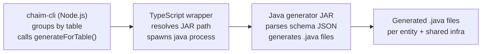

# AI Agent Context: chaim-client-java

**Purpose**: Structured context for AI agents to understand and modify the chaim-client-java repository.  
This package is a hybrid Node and Java code generator that converts bprint schemas into production-ready Java source code with DynamoDB Enhanced Client integration.

**Package**: `@chaim-tools/client-java`  
**Version**: 0.1.0  
**License**: Apache-2.0

---

## What this repo does

chaim-client-java generates **production-ready Java source code** from schema JSON and datastore metadata.  
It is an **internal dependency** of `chaim-cli` — end users should not invoke it directly.

**Invocation model**:
- End users run `chaim generate --language java --package com.example.model`
- chaim-cli reads OS cache snapshots and invokes this package internally
- Direct JAR invocation is only for local development/testing

**Data flow**:
```
.bprint file → chaim-cdk → OS cache snapshot → chaim-cli → chaim-client-java → .java files
                                                   ↑
                                            user runs this
```

> **Note**: This package does not read `.bprint` files or OS cache snapshots directly. It receives parsed schema JSON from `chaim-cli`.

**Primary outputs**:
- Entity DTOs with DynamoDB Enhanced Client annotations (`@DynamoDbBean`, `@DynamoDbPartitionKey`, `@DynamoDbSortKey`)
- Key composition helpers (`{Entity}Keys.java`)
- Repository classes with PK/SK-based CRUD operations
- DI-friendly DynamoDB client wrapper (`ChaimDynamoDbClient.java`)
- Configuration with repository factory methods (`ChaimConfig.java`)

---

## How it works

**Runtime flow**:
1. chaim-cli groups snapshots by physical table (using `tableArn` or composite key)
2. chaim-cli calls `JavaGenerator.generateForTable()` with all schemas for a table
3. The TypeScript wrapper spawns `java -jar` with schemas and metadata as JSON
4. The Java generator parses JSON and writes Java files to the output directory



---

## Single-Table Design Support

The generator natively supports DynamoDB single-table design:

1. **Multiple entities per table**: Multiple `.bprint` schemas can bind to the same DynamoDB table
2. **Entity-prefixed keys**: Generated `pk`/`sk` fields use entity prefixes (e.g., `USER#`, `ORDER#`)
3. **Shared infrastructure once**: `ChaimDynamoDbClient` and `ChaimConfig` are generated once per table
4. **Per-entity artifacts**: Entity DTOs, Keys helpers, and Repositories are generated for each schema

```
Table: DataTable
├── User (pk: "USER#{userId}", sk: "USER")
├── Order (pk: "ORDER#{orderId}", sk: "ORDER")
└── Product (pk: "PRODUCT#{productId}", sk: "PRODUCT")
```

---

## Inputs and outputs

**Inputs**:
- Array of schema JSON objects (extracted from OS cache snapshots by chaim-cli)
- Java package name
- Output directory
- Table metadata JSON (tableName, tableArn, region)

**Outputs**:
- `.java` files written to the output directory under the provided package namespace

---

## CLI interface

Java is invoked with **multiple schemas** (single-table design):

```bash
# Inline JSON array
java -jar codegen-java.jar \
  --schemas '[{"schemaVersion":"v1",...},{"schemaVersion":"v1",...}]' \
  --package com.example.model \
  --output ./src/main/java \
  --table-metadata '{"tableName":"DataTable","tableArn":"arn:..."}'

# File-based (for large payloads)
java -jar codegen-java.jar \
  --schemas-file /tmp/schemas.json \
  --package com.example.model \
  --output ./src/main/java \
  --table-metadata '{"tableName":"DataTable",...}'
```

| Argument | Required | Description |
|----------|----------|-------------|
| `--schemas` | Yes* | JSON array of schema objects |
| `--schemas-file` | Yes* | Path to file containing JSON array of schemas |
| `--package` | Yes | Java package name |
| `--output` | Yes | Output directory |
| `--table-metadata` | No | Table metadata JSON string |

*One of `--schemas` or `--schemas-file` is required.

---

## Repository structure

```
chaim-client-java/
├── schema-core/          # Schema loading and validation
├── cdk-integration/      # AWS metadata containers and readers
├── codegen-java/         # Java generator engine
├── src/                  # TypeScript wrapper source
└── dist/                 # Compiled TypeScript and bundled JARs
```

---

## Modules

### schema-core

**Responsibilities**:
- Load bprint JSON
- Validate schema shape
- Map field types

**Key classes**:
| Class | Purpose |
|-------|---------|
| `BprintLoader` | Loads schema JSON using Jackson |
| `BprintValidator` | Validates structure and fields |
| `FieldType` | Maps bprint types to Java types |
| `BprintSchema` | Jackson model for schema |

### cdk-integration

**Responsibilities**:
- Represent and read deployment metadata
- Provide table metadata used by codegen

**Key classes**:
| Class | Purpose |
|-------|---------|
| `TableMetadata` | DynamoDB metadata container |
| `CloudFormationReader` | Reads stack outputs |
| `ChaimStackOutputs` | Output container |

### codegen-java

**Responsibilities**:
- Parse command-line args (single or multiple schemas)
- Parse schema and metadata JSON payloads
- Generate Java source files via JavaPoet

**Key classes**:
| Class | Purpose |
|-------|---------|
| `Main` | Entry point for `java -jar` |
| `JavaGenerator` | Generates DTOs, keys, repositories, client, config |

---

## Generated output layout

Example: `--package com.example.model` with User and Order schemas

```
com/example/model/
├── User.java                      # Entity DTO with pk/sk
├── Order.java                     # Entity DTO with pk/sk
├── keys/
│   ├── UserKeys.java              # Key composition helpers
│   └── OrderKeys.java             # Key composition helpers
├── repository/
│   ├── UserRepository.java        # PK/SK-based CRUD
│   └── OrderRepository.java       # PK/SK-based CRUD
├── client/
│   └── ChaimDynamoDbClient.java   # DI-friendly client wrapper
└── config/
    └── ChaimConfig.java           # Constants + repository factories
```

---

## Generated artifacts detail

### Entity DTO (`User.java`)

```java
@Data
@Builder
@NoArgsConstructor
@AllArgsConstructor
@DynamoDbBean
public class User {
    private String pk;    // Partition key (e.g., "USER#user-123")
    private String sk;    // Sort key (e.g., "USER")
    private String userId;
    private String email;

    @DynamoDbPartitionKey
    public String getPk() { return pk; }

    @DynamoDbSortKey
    public String getSk() { return sk; }
}
```

### Key Helpers (`UserKeys.java`)

```java
public final class UserKeys {
    public static final String ENTITY_PREFIX = "USER#";
    public static final String DEFAULT_SK = "USER";

    public static String pk(String userId) {
        return ENTITY_PREFIX + userId;
    }

    public static String sk() {
        return DEFAULT_SK;
    }

    public static Key key(String userId) {
        return Key.builder()
            .partitionValue(pk(userId))
            .sortValue(sk())
            .build();
    }
}
```

### Repository (`UserRepository.java`)

```java
public class UserRepository {
    private final DynamoDbTable<User> table;

    // Constructor with ChaimDynamoDbClient
    public UserRepository(ChaimDynamoDbClient client) { ... }

    // Constructor for DI/testing
    public UserRepository(DynamoDbEnhancedClient enhancedClient, String tableName) { ... }

    public void save(User entity) { ... }
    public Optional<User> findByPkSk(String pk, String sk) { ... }
    public Optional<User> findByUserId(String userId) { ... }  // Convenience
    public void deleteByPkSk(String pk, String sk) { ... }
    public void deleteByUserId(String userId) { ... }  // Convenience
    // NOTE: No findAll() or scan() - intentionally omitted
}
```

### DI-Friendly Client (`ChaimDynamoDbClient.java`)

```java
public class ChaimDynamoDbClient {
    public static Builder builder() { ... }
    public static ChaimDynamoDbClient wrap(DynamoDbEnhancedClient client, String tableName) { ... }

    public DynamoDbEnhancedClient getEnhancedClient() { ... }
    public String getTableName() { ... }

    public static class Builder {
        public Builder tableName(String tableName) { ... }
        public Builder region(String region) { ... }
        public Builder endpoint(String endpoint) { ... }  // For local DynamoDB
        public Builder existingClient(DynamoDbEnhancedClient client) { ... }  // For DI
        public ChaimDynamoDbClient build() { ... }
    }
}
```

### Configuration (`ChaimConfig.java`)

```java
public class ChaimConfig {
    public static final String TABLE_NAME = "DataTable";
    public static final String TABLE_ARN = "arn:aws:dynamodb:...";
    public static final String REGION = "us-east-1";

    public static ChaimDynamoDbClient getClient() { ... }  // Lazy singleton
    public static ChaimDynamoDbClient.Builder clientBuilder() { ... }

    // Repository factory methods
    public static UserRepository userRepository() { ... }
    public static UserRepository userRepository(ChaimDynamoDbClient client) { ... }
    public static OrderRepository orderRepository() { ... }
    public static OrderRepository orderRepository(ChaimDynamoDbClient client) { ... }
}
```

---

## Type mapping

| bprint type | Java type |
|-------------|-----------|
| `string` | `String` |
| `number` | `Double` |
| `boolean` | `Boolean` |
| `timestamp` | `Instant` |
| (unknown) | `Object` |

---

## Annotations used

| Annotation | Source | Purpose |
|------------|--------|---------|
| `@DynamoDbBean` | AWS SDK | Marks class as DynamoDB entity |
| `@DynamoDbPartitionKey` | AWS SDK | Marks partition key getter |
| `@DynamoDbSortKey` | AWS SDK | Marks sort key getter |
| `@Data` | Lombok | Generates getters, setters, equals, hashCode, toString |
| `@Builder` | Lombok | Generates builder pattern |
| `@NoArgsConstructor` | Lombok | Generates no-args constructor |
| `@AllArgsConstructor` | Lombok | Generates all-args constructor |

---

## Build and packaging

One command builds everything:

```bash
npm run build
```

**Steps**:
1. Gradle builds Java modules and JAR
2. TypeScript compiles to dist
3. JAR is copied into `dist/jars/` for npm publishing

**Published artifacts**:
- `dist/index.js` — TypeScript wrapper
- `dist/jars/codegen-java-0.1.0.jar` — Fat JAR with all dependencies

---

## JAR resolution logic

The wrapper checks for JAR in this order:
1. **Bundled** (npm install): `dist/jars/codegen-java-*.jar`
2. **Development** (local): `codegen-java/build/libs/codegen-java-*.jar`

---

## Entity name derivation

When `entity.name` is not present in the schema, the generator derives it from `namespace`:

```java
// Priority: entity.name > namespace derivation > "Entity"
// Example: "example.users" → "Users"
String[] parts = schema.namespace.split("\\.");
String lastPart = parts[parts.length - 1];
return capitalize(lastPart);
```

---

## Integration with chaim-cli

chaim-cli imports `JavaGenerator` from `@chaim-tools/client-java`:

```typescript
import { JavaGenerator } from '@chaim-tools/client-java';

const generator = new JavaGenerator();

await generator.generateForTable(
  schemas,          // Array of schema objects
  packageName,      // --package flag
  outputDir,        // --output flag
  tableMetadata     // { tableName, tableArn, region }
);
```

---

## Key files to modify

| Task | File |
|------|------|
| Change wrapper spawn logic | `src/index.ts` |
| Change arg parsing | `codegen-java/.../Main.java` |
| Change code generation | `codegen-java/.../JavaGenerator.java` |
| Change schema model | `schema-core/.../BprintSchema.java` |
| Change table metadata shape | `cdk-integration/.../TableMetadata.java` |

---

## Requirements

| Component | Version |
|-----------|---------|
| **Java** | **17 LTS** (runtime — JAR is compiled with `--release 17`) |
| **Node.js** | 18+ |
| **Gradle** | 8+ |

> ✅ **Java 17 LTS** is required at runtime. This ensures broad enterprise compatibility.

---

## Common tasks and where to edit

| Task | Where |
|------|-------|
| Add a new bprint field type | `schema-core/.../FieldType.java` and `codegen-java/.../JavaGenerator.java` (mapType) |
| Change repository methods | `codegen-java/.../JavaGenerator.java` (generateRepository) |
| Add a new generated file | `codegen-java/.../JavaGenerator.java` (add new generate method) |
| Add new table metadata fields | `cdk-integration/.../TableMetadata.java` and `codegen-java/.../Main.java` (parseTableMetadata) |
| Change CLI argument parsing | `codegen-java/.../Main.java` |
| Change key composition logic | `codegen-java/.../JavaGenerator.java` (generateEntityKeys) |
| Change client builder | `codegen-java/.../JavaGenerator.java` (generateChaimDynamoDbClient) |

---

## Non-goals

This package does **not**:
- Deploy AWS resources (that's chaim-cdk)
- Validate cloud account permissions
- Parse bprint from disk — it receives schema JSON from chaim-cli
- Generate code for languages other than Java
- Generate `scan()` or `findAll()` methods (NoSQL anti-pattern)

---

## Related packages

| Package | Relationship | Purpose |
|---------|--------------|---------|
| `chaim-cli` | **Consumer** | Invokes JavaGenerator for SDK generation |
| `@chaim-tools/chaim-bprint-spec` | **Schema format** | Defines .bprint schema structure |
| `@chaim-tools/cdk-lib` | **Upstream** | Produces snapshots with schema + metadata |

---

## Development commands

| Command | Purpose |
|---------|---------|
| `npm run build` | Full build (Java + TypeScript + bundle) |
| `./gradlew build` | Build Java modules only |
| `./gradlew test` | Run Java tests |
| `npm run build:ts` | Compile TypeScript only |
| `npm run clean` | Clean all build artifacts |

---

**Note**: This repo is hybrid by design. TypeScript provides the stable interface for chaim-cli. Java does the actual generation using JavaPoet. The JAR is bundled for npm distribution.
