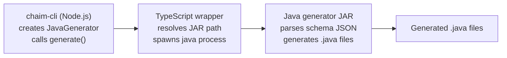

# AI Agent Context: chaim-client-java

**Purpose**: Structured context for AI agents to understand and modify the chaim-client-java repository.  
This package is a hybrid Node and Java code generator that converts bprint schemas into Java source code.

**Package**: `@chaim-tools/client-java`  
**Version**: 0.1.0  
**License**: Apache-2.0

---

## What this repo does

chaim-client-java generates Java source code from schema JSON and optional datastore metadata.  
It is an **internal dependency** of `chaim-cli` — end users should not invoke it directly.

**Invocation model**:
- End users run `chaim generate --language java --package com.example.model`
- chaim-cli reads OS cache snapshots and invokes this package internally
- Direct JAR invocation is only for local development/testing

**Data flow**:
```
.bprint file → chaim-cdk → OS cache snapshot → chaim-cli → chaim-client-java → .java files
                                                   ↑
                                            user runs this
```

> **Note**: This package does not read `.bprint` files or OS cache snapshots directly. It receives parsed schema JSON from `chaim-cli`.

**Primary outputs**:
- Entity DTO classes
- ChaimConfig configuration class
- ChaimMapperClient DynamoDB mapper client

---

## How it works

**Runtime flow**:
1. chaim-cli calls `JavaGenerator` from this npm package
2. The TypeScript wrapper resolves a JAR path and spawns `java -jar` with schema and metadata payloads as JSON strings
3. The Java generator parses JSON and writes Java files to the output directory



---

## Inputs and outputs

**Inputs**:
- schema JSON (extracted from OS cache snapshot by chaim-cli)
- Java package name
- output directory
- optional table metadata JSON (extracted from OS cache snapshot by chaim-cli)

**Outputs**:
- .java files written to the output directory under the provided package namespace

---

## CLI interface

Java is invoked like this:

```bash
java -jar codegen-java.jar \
  --schema '<schemaJson>' \
  --package com.example.model \
  --output ./src/main/java \
  --table-metadata '<tableMetadataJson>'
```

| Argument | Required | Description |
|----------|----------|-------------|
| `--schema` | Yes | Schema JSON string |
| `--package` | Yes | Java package name |
| `--output` | Yes | Output directory |
| `--table-metadata` | No | Table metadata JSON string |

---

## Repository structure

```
chaim-client-java/
├── schema-core/          # Schema loading and validation
├── cdk-integration/      # AWS metadata containers and readers
├── codegen-java/         # Java generator engine
├── src/                  # TypeScript wrapper source
└── dist/                 # Compiled TypeScript and bundled JARs
```

---

## Modules

### schema-core

**Responsibilities**:
- Load bprint JSON
- Validate schema shape
- Map field types

**Key classes**:
| Class | Purpose |
|-------|---------|
| `BprintLoader` | Loads schema JSON using Jackson |
| `BprintValidator` | Validates structure and fields |
| `FieldType` | Maps bprint types to Java types |
| `BprintSchema` | Jackson model for schema |

### cdk-integration

**Responsibilities**:
- Represent and read deployment metadata
- Provide table metadata used by codegen

**Key classes**:
| Class | Purpose |
|-------|---------|
| `TableMetadata` | DynamoDB metadata container |
| `CloudFormationReader` | Reads stack outputs |
| `ChaimStackOutputs` | Output container |

### codegen-java

**Responsibilities**:
- Parse command-line args
- Parse schema and metadata JSON payloads
- Generate Java source files via JavaPoet

**Key classes**:
| Class | Purpose |
|-------|---------|
| `Main` | Entry point for `java -jar` |
| `JavaGenerator` | Generates DTOs, config, and mapper client |

---

## Generated output layout

Example: `--package com.example.model`

```
com/example/model/
├── Users.java              # Entity DTO
├── config/
│   └── ChaimConfig.java    # Table configuration
└── mapper/
    └── ChaimMapperClient.java  # DynamoDB mapper
```

---

## Type mapping

| bprint type | Java type |
|-------------|-----------|
| `string` | `String` |
| `number` | `Double` |
| `boolean` | `Boolean` |
| `timestamp` | `Instant` |
| (unknown) | `Object` |

---

## Build and packaging

One command builds everything:

```bash
npm run build
```

**Steps**:
1. Gradle builds Java modules and JAR
2. TypeScript compiles to dist
3. JAR is copied into `dist/jars/` for npm publishing

**Published artifacts**:
- `dist/index.js` — TypeScript wrapper
- `dist/jars/codegen-java-0.1.0.jar` — Fat JAR with all dependencies

---

## JAR resolution logic

The wrapper checks for JAR in this order:
1. **Bundled** (npm install): `dist/jars/codegen-java-*.jar`
2. **Development** (local): `codegen-java/build/libs/codegen-java-*.jar`

---

## Entity name derivation

When `entity.name` is not present in the schema, the generator derives it from `namespace`:

```java
// Priority: entity.name > namespace derivation > "Entity"
// Example: "example.users" → "Users"
String[] parts = schema.namespace.split("\\.");
String lastPart = parts[parts.length - 1];
return capitalize(lastPart);
```

---

## Integration with chaim-cli

chaim-cli imports `JavaGenerator` from `@chaim-tools/client-java`:

```typescript
import { JavaGenerator } from '@chaim-tools/client-java';

const generator = new JavaGenerator();
await generator.generate(
  snapshot.schema,    // Schema from snapshot
  packageName,        // --package flag
  outputDir,          // --output flag
  tableMetadata       // Extracted from snapshot.dataStore
);
```

---

## Key files to modify

| Task | File |
|------|------|
| Change wrapper spawn logic | `src/index.ts` |
| Change arg parsing | `codegen-java/.../Main.java` |
| Change code generation | `codegen-java/.../JavaGenerator.java` |
| Change schema model | `schema-core/.../BprintSchema.java` |
| Change table metadata shape | `cdk-integration/.../TableMetadata.java` |

---

## Requirements

| Component | Version |
|-----------|---------|
| **Java** | **22** (required — JAR is compiled with `--release 22`) |
| **Node.js** | 18+ |
| **Gradle** | 8+ |

> ⚠️ **Java 22 is required at runtime**. The JAR will not run on older JVMs.

---

## Common tasks and where to edit

| Task | Where |
|------|-------|
| Add a new bprint field type | `schema-core/.../FieldType.java` and `codegen-java/.../JavaGenerator.java` (mapType) |
| Change mapper client API shape | `codegen-java/.../JavaGenerator.java` (generateChaimMapperClient) |
| Add a new generated file | `codegen-java/.../JavaGenerator.java` (add new generate method) |
| Add new table metadata fields | `cdk-integration/.../TableMetadata.java` and `codegen-java/.../Main.java` (parseTableMetadata) |
| Change CLI argument parsing | `codegen-java/.../Main.java` |

---

## Non-goals

This package does **not**:
- Deploy AWS resources (that's chaim-cdk)
- Validate cloud account permissions
- Parse bprint from disk — it receives schema JSON from chaim-cli
- Generate code for languages other than Java

---

## Related packages

| Package | Relationship | Purpose |
|---------|--------------|---------|
| `chaim-cli` | **Consumer** | Invokes JavaGenerator for SDK generation |
| `@chaim-tools/chaim-bprint-spec` | **Schema format** | Defines .bprint schema structure |
| `@chaim-tools/cdk-lib` | **Upstream** | Produces snapshots with schema + metadata |

---

## Development commands

| Command | Purpose |
|---------|---------|
| `npm run build` | Full build (Java + TypeScript + bundle) |
| `./gradlew build` | Build Java modules only |
| `./gradlew test` | Run Java tests |
| `npm run build:ts` | Compile TypeScript only |
| `npm run clean` | Clean all build artifacts |

---

**Note**: This repo is hybrid by design. TypeScript provides the stable interface for chaim-cli. Java does the actual generation using JavaPoet. The JAR is bundled for npm distribution.
